<!--
---
title: "Mapa de Carreira em Tecnologia - Índice Geral"
description: "Índice geral e navegação para os arquivos do mapa de carreira em tecnologia."
author: "Tiago N Pinto Silva"
created_date: "2024-06-10"
version: "1.0.0"
confidence: "high"
tags:
  - mapa-carreira
  - tech-roles
  - indice
categories:
  - Carreira
  - Tecnologia
language: "pt-BR"
---
-->
<!--
⚠️ Bloco acima: metadados para busca semântica e IA. Pode ser ignorado na leitura.
-->

# 🗺️ Mapa de Carreira em Tecnologia - Índice Geral {#indice-mapa-carreira}

<!-- summary:start -->
> Este documento serve como índice geral e guia de navegação para os arquivos que compõem o mapa de carreira em tecnologia, facilitando o acesso a cada pilar, trilha, matriz e referência.
<!-- summary:end -->

## 📑 Seções do Mapa de Carreira

- [Visão Geral do Mapa de Carreira](01_visao-geral-mapa-carreira.md)
- [Pilares Organizacionais](02_pilares-organizacionais.md)
- [Trilhas Profissionais](03_trilhas-profissionais.md)
- [Níveis de Senioridade](04_niveis-senioridade.md)
- [Competências Transversais](05_competencias-transversais.md)
- [Matriz de Carreira](06_matriz-carreira.md)
- [Referências do Mapa de Carreira](07_referencias-mapa-carreira.md)

# 🗺️ Mapa de Carreira - Times de Tecnologia

## 🏛️ 1. Visão Geral da Estrutura

```mermaid
%%{init: { "themeVariables": { "fontFamily": "Arial", "fontSize": "10px" } }}%%
flowchart TD
    subgraph Engenharia de Software
        ES1[Engenheiro de Software Jr]
        ES2[Engenheiro de Software Pl]
        ES3[Engenheiro de Software Sr]
        ES4[Engenheiro de Software Especialista]
        TL1[Tech Lead]
        AS1[Arquiteto de Solução]
        HE1[Head de Engenharia]
        VP1[VP de Engenharia / CTO]
        ES1 --> ES2 --> ES3 --> ES4 --> TL1 --> AS1 --> HE1 --> VP1
    end

    subgraph Dados e IA
        ED1[Engenheiro de Dados Jr]
        ED2[Engenheiro de Dados Pl]
        ED3[Engenheiro de Dados Sr]
        ESP1[Especialista em IA/ML]
        TLD[Tech Lead de Dados]
        AD[Arquiteto de Dados]
        HD[Head de Dados e IA]
        CDO[Chief Data Officer]
        ED1 --> ED2 --> ED3 --> ESP1 --> TLD --> AD --> HD --> CDO
    end

    subgraph Infraestrutura e DevOps
        EC1[Engenheiro de Cloud Jr]
        EC2[Engenheiro de Cloud Pl]
        SRE[Engenheiro DevOps/SRE Sr]
        ER[Especialista em Reliability]
        TLI[Tech Lead de Infraestrutura]
        AN[Arquiteto de Nuvem]
        HI[Head de Infraestrutura]
        EC1 --> EC2 --> SRE --> ER --> TLI --> AN --> HI
    end

    subgraph Segurança e Compliance
        ACS1[Analista de Cyber Segurança Jr]
        ACS2[Analista de Cyber Segurança Pl]
        ACS3[Analista de Cyber Segurança Sr]
        EC[Especialista em Compliance]
        TLS[Tech Lead de Segurança]
        AS[Arquiteto de Segurança]
        HSC[Head de Segurança & Compliance]
        CISO[Chief Information Security Officer]
        ACS1 --> ACS2 --> ACS3 --> EC --> TLS --> AS --> HSC --> CISO
    end

    subgraph Produto e Design
        UX1[UX/UI Designer Jr]
        UX2[UX/UI Designer Pl]
        UX3[UX/UI Designer Sr]
        PO[Product Owner]
        PDL[Product Designer Lead]
        HPD[Head de Produto & Design]
        VP2[VP de Produto]
        UX1 --> UX2 --> UX3 --> PDL --> HPD --> VP2
        PO --> HPD
    end

    style Engenharia de Software fill:#e3f2fd,stroke:#2196f3,stroke-width:2px
    style Dados e IA fill:#e8f5e9,stroke:#43a047,stroke-width:2px
    style Infraestrutura e DevOps fill:#fffde7,stroke:#fbc02d,stroke-width:2px
    style Segurança e Compliance fill:#ffebee,stroke:#e53935,stroke-width:2px
    style Produto e Design fill:#f3e5f5,stroke:#8e24aa,stroke-width:2px
```

Este mapa de carreira define a progressão profissional para profissionais de tecnologia, contemplando tanto trilhas individuais quanto gerenciais. A estrutura está organizada em quatro pilares principais, permitindo especialização técnica profunda ou transição para funções de liderança.

## 🏗️ 2. Pilares Organizacionais

### 👔 2.1. Liderança Executiva
- **Chief Technology Officer (CTO)**
- **Chief Data Officer (CDO)**
- **Chief Information Security Officer (CISO)**
- **VP de Engenharia**
- **VP de Produto**

### 👨‍💻 2.2. Liderança Técnica
- **Head de Engenharia**
- **Head de Dados e IA**
- **Head de Segurança & Compliance**
- **Head de Produto & Design**

### 🧑‍🔬 2.3. Especialistas e Arquitetos
- **Arquiteto de Solução**
- **Arquiteto de Dados**
- **Arquiteto de Segurança**
- **Arquiteto de Nuvem**
- **Product Owner**

### 🛠️ 2.4. Time Técnico Operacional
- **Engenheiros de Software (Jr/Pl/Sr)**
- **Engenheiros de Dados (Jr/Pl/Sr)**
- **Engenheiros de Cloud (Jr/Pl/Sr)**
- **Especialistas em IA/ML (Jr/Pl/Sr)**
- **Engenheiros DevOps/SRE (Jr/Pl/Sr)**
- **Analistas de Cyber Segurança (Jr/Pl/Sr)**
- **Designers UX/UI (Jr/Pl/Sr)**
- **QA Engineers (Jr/Pl/Sr)**
- **Especialistas em Compliance (Jr/Pl/Sr)**

## 🛤️ 3. Trilhas de Carreira

### 💻 3.1. Trilha de Engenharia de Software

#### 🔹 Níveis Individuais
1. **Engenheiro de Software Jr**
   - 0-2 anos de experiência
   - Foco em desenvolvimento de features sob supervisão
   - Conhecimentos básicos em uma stack específica

2. **Engenheiro de Software Pl**
   - 2-4 anos de experiência
   - Desenvolvimento autônomo de funcionalidades
   - Participação ativa em code reviews
   - Conhecimento em múltiplas áreas do sistema

3. **Engenheiro de Software Sr**
   - 4-7 anos de experiência
   - Liderança técnica de pequenas equipes
   - Mentoria de desenvolvedores juniores
   - Decisões arquiteturais de menor escopo

4. **Engenheiro de Software Especialista**
   - 7-10 anos de experiência
   - Especialização profunda em domínios críticos
   - Referência técnica na organização
   - Contribuição para decisões arquiteturais significativas

#### 🔸 Níveis de Liderança
5. **Tech Lead**
   - Liderança técnica de equipes de 5-8 pessoas
   - Definição de padrões e práticas de desenvolvimento
   - Facilitação técnica e remoção de impedimentos

6. **Arquiteto de Solução**
   - Definição de arquitetura de sistemas complexos
   - Alinhamento entre tecnologia e necessidades de negócio
   - Garantia de qualidade, escalabilidade e manutenibilidade

7. **Head de Engenharia**
   - Gestão estratégica da área de engenharia
   - Liderança de múltiplas equipes de desenvolvimento
   - Alinhamento com objetivos estratégicos da empresa

8. **VP de Engenharia / CTO**
   - Visão estratégica de tecnologia
   - Decisões de investimento e roadmap tecnológico
   - Liderança executiva

### 📊 3.2. Trilha de Dados e IA

#### 🔹 Níveis Individuais
1. **Engenheiro de Dados Jr**
   - 0-2 anos de experiência
   - Suporte na criação e manutenção de pipelines de dados
   - Conhecimentos básicos em SQL e ferramentas ETL

2. **Engenheiro de Dados Pl**
   - 2-4 anos de experiência
   - Desenvolvimento autônomo de pipelines
   - Modelagem de dados sob orientação
   - Conhecimento em processamento batch e streaming

3. **Engenheiro de Dados Sr**
   - 4-7 anos de experiência
   - Desenho de pipelines complexos
   - Otimização de performance
   - Mentoria de juniores

4. **Especialista em IA/ML**
   - Desenvolvimento de modelos de machine learning
   - Implementação de soluções de IA para insights de negócio
   - Expertise em algoritmos relevantes para a área de atuação

#### 🔸 Níveis de Liderança
5. **Tech Lead de Dados**
   - Liderança técnica da equipe de dados
   - Definição de padrões e práticas de engenharia de dados
   - Garantia de qualidade dos pipelines

6. **Arquiteto de Dados**
   - Definição da arquitetura completa de dados
   - Estratégias de governança e qualidade
   - Desenho de soluções escaláveis para dados

7. **Head de Dados e IA**
   - Gestão estratégica da área de dados e IA
   - Alinhamento entre estratégia de dados e objetivos de negócio
   - Supervisão de iniciativas de IA/ML

8. **Chief Data Officer (CDO)**
   - Estratégia global de dados e IA
   - Garantia de compliance e ética no uso de dados
   - Monetização responsável de ativos de dados

### ☁️ 3.3. Trilha de Infraestrutura e DevOps

#### 🔹 Níveis Individuais
1. **Engenheiro de Cloud Jr**
   - 0-2 anos de experiência
   - Implementação de infraestrutura sob orientação
   - Conhecimentos básicos em serviços cloud

2. **Engenheiro de Cloud Pl**
   - 2-4 anos de experiência
   - Implementação autônoma de infraestrutura
   - Automação de processos e IaC

3. **Engenheiro DevOps/SRE Sr**
   - 4-7 anos de experiência
   - Desenho de pipelines CI/CD
   - Implementação de práticas de observabilidade
   - Gestão de incidentes

4. **Especialista em Reliability**
   - Foco em resiliência e alta disponibilidade
   - Desenho de sistemas distribuídos robustos
   - Gestão avançada de observabilidade

#### 🔸 Níveis de Liderança
5. **Tech Lead de Infraestrutura**
   - Liderança técnica da equipe de infraestrutura
   - Definição de padrões de DevOps e SRE
   - Garantia de estabilidade dos ambientes

6. **Arquiteto de Nuvem**
   - Definição da arquitetura de infraestrutura cloud
   - Estratégias de custos e otimização
   - Desenho para alta disponibilidade e disaster recovery

7. **Head de Infraestrutura**
   - Gestão estratégica da infraestrutura tecnológica
   - Supervisão de múltiplas equipes de infraestrutura
   - Definição de SLAs e políticas operacionais

### 🔒 3.4. Trilha de Segurança e Compliance

#### 🔹 Níveis Individuais
1. **Analista de Cyber Segurança Jr**
   - 0-2 anos de experiência
   - Suporte em análises de segurança básicas
   - Monitoramento de alertas sob supervisão

2. **Analista de Cyber Segurança Pl**
   - 2-4 anos de experiência
   - Implementação de controles de segurança
   - Análise de vulnerabilidades

3. **Analista de Cyber Segurança Sr**
   - 4-7 anos de experiência
   - Gestão de incidentes de segurança
   - Implementação de estratégias de proteção
   - Análises avançadas de ameaças

4. **Especialista em Compliance**
   - Expertise em regulamentações relevantes ao setor
   - Implementação de controles de compliance
   - Definição de políticas de segurança e privacidade

#### 🔸 Níveis de Liderança
5. **Tech Lead de Segurança**
   - Liderança técnica da equipe de segurança
   - Definição de padrões e práticas de segurança
   - Gestão de resposta a incidentes

6. **Arquiteto de Segurança**
   - Definição da arquitetura de segurança
   - Desenho de estratégias de proteção de dados
   - Security by design nos sistemas

7. **Head de Segurança & Compliance**
   - Gestão estratégica da segurança corporativa
   - Supervisão de iniciativas de compliance
   - Relacionamento com reguladores

8. **Chief Information Security Officer (CISO)**
   - Estratégia global de segurança da informação
   - Gestão de riscos cibernéticos
   - Política de segurança corporativa

### 🎨 3.5. Trilha de Produto e Design

#### 🔹 Níveis Individuais
1. **UX/UI Designer Jr**
   - 0-2 anos de experiência
   - Criação de interfaces sob supervisão
   - Suporte em pesquisas com usuários

2. **UX/UI Designer Pl**
   - 2-4 anos de experiência
   - Desenho autônomo de interfaces
   - Condução de testes de usabilidade

3. **UX/UI Designer Sr**
   - 4-7 anos de experiência
   - Definição de sistemas de design
   - Liderança de projetos de UX complexos
   - Mentoria de designers juniores

4. **Product Owner**
   - Definição de roadmap de produto
   - Priorização de backlog
   - Garantia de valor de negócio das entregas

#### 🔸 Níveis de Liderança
5. **Product Designer Lead**
   - Liderança da equipe de design
   - Definição de diretrizes de experiência do usuário
   - Alinhamento entre negócio e UX

6. **Head de Produto & Design**
   - Gestão estratégica da área de produto
   - Supervisão de múltiplas equipes de produto e design
   - Definição da visão de produto

### 🚀 3.6. Trilha de Gestão ágil

1. **Agile Coach / Scrum Master**
   - Facilitação de metodologias ágeis
   - Remoção de impedimentos
   - Melhoria contínua de processos

2. **Gerente de Projetos**
   - Gestão de cronogramas e dependências
   - Gerenciamento de stakeholders
   - Garantia de entregas no prazo e orçamento

3. **Head de PMO**
   - Definição de metodologias de gestão
   - Supervisão de múltiplos projetos
   - Alinhamento com objetivos estratégicos

## 📈 4. Progressão e Desenvolvimento

### 📝 4.1. Critérios de Progressão

#### Critérios Técnicos
- Profundidade de conhecimento técnico
- Qualidade e complexidade das entregas
- Capacidade de resolução de problemas
- Contribuição para arquitetura e design
- Implementação de boas práticas

#### Critérios de Liderança
- Influência e mentoria
- Tomada de decisão
- Gestão de stakeholders
- Comunicação efetiva
- Desenvolvimento de pessoas

#### Critérios de Impacto no Negócio
- Contribuição para objetivos estratégicos
- Inovação e melhoria contínua
- Orientação para resultados
- Percepção de valor pelos stakeholders

### 📋 4.2. Plano de Desenvolvimento Individual (PDI)

Para cada colaborador, será criado um PDI contemplando:

- **Objetivos técnicos**: Competências a serem desenvolvidas
- **Objetivos comportamentais**: Habilidades interpessoais
- **Ações de desenvolvimento**: Cursos, projetos, mentoria
- **Indicadores de progresso**: Métricas de avaliação
- **Cronograma**: Prazos para atingimento de objetivos

### 📊 4.3. Avaliações e Feedback

- **Avaliações formais**: Semestrais, com base em objetivos definidos
- **Feedbacks contínuos**: Sessões mensais de feedback com líderes diretos
- **Avaliação 360°**: Anual, incluindo pares, líderes e liderados
- **Calibragem**: Alinhamento entre líderes sobre avaliações da equipe

## 📊 5. Matriz de Competências por Cargo

| Cargo | Competências Técnicas | Competências de Liderança | Competências de Negócio |
|-------|------------------------|---------------------------|--------------------------|
| CTO | Visão tecnológica ampla, Arquitetura empresarial | Liderança executiva, Visão estratégica | Alinhamento com negócio, Gestão de investimentos |
| Arquiteto de Solução | Arquitetura de sistemas, Design patterns, Integrações | Influência técnica, Mentoria | Tradução de requisitos, Análise de trade-offs |
| Arquiteto de Dados | Modelagem de dados, Big data, Governança | Liderança técnica, Consultoria interna | Valor estratégico dos dados, Compliance |
| Engenheiro Cloud Sr | IaC, DevOps, Segurança em nuvem | Mentoria técnica, Documentação | Otimização de custos, SLAs |
| Especialista em Cyber Segurança | Segurança ofensiva/defensiva, Compliance | Educação em segurança, Gestão de crises | Avaliação de riscos, Normas regulatórias |
| Product Owner | Gestão de produto, Priorização, Métricas | Stakeholder management, Negociação | Visão de produto, Análise de mercado |
| Agile Coach | Frameworks ágeis, Facilitação, Métricas | Coaching, Remoção de impedimentos | Entrega de valor, Melhoria contínua |

## 📊 6. Movimentações na Carreira

### 📊 6.1. Movimentação Vertical
- Progressão dentro da mesma trilha para níveis mais seniores
- Baseada em mérito, competências e disponibilidade de vagas
- Processo formal de avaliação e promoção (semestral/anual)

### 📊 6.2. Movimentação Horizontal
- Transição entre diferentes trilhas (ex: Engenharia ? Dados)
- Requer plano de desenvolvimento específico
- Pode incluir período de transição com responsabilidades híbridas

### 📊 6.3. Movimentação para Liderança
- Identificação de potenciais líderes no processo de avaliação
- Programa de desenvolvimento de lideranças
- Oportunidades de liderança técnica como preparação

## 🎉 7. Benefícios e Reconhecimento

### 🎉 7.1. Estrutura de Compensação
- Salário base competitivo com o mercado
- Remuneração variável baseada em desempenho
- Stock options para níveis seniores e liderança

### 🎉 7.2. Programas de Reconhecimento
- Reconhecimento por contribuições técnicas excepcionais
- Bônus por projetos de alto impacto
- Oportunidades de participação em eventos e conferências

### 🎉 7.3. Desenvolvimento Contínuo
- Orçamento anual para capacitação técnica
- Participação em comunidades técnicas
- Incentivo à obtenção de certificações relevantes

## 🛠️ 8. Implementação e Evolução

### 🛠️ 8.1. Fases de Implementação
1. **Fase Inicial**: Definição das trilhas críticas (Engenharia, Dados, Segurança)
2. **Expansão**: Inclusão de trilhas complementares à medida que a empresa cresce
3. **Maturação**: Refinamento contínuo baseado em feedback e necessidades do negócio

### 🛠️ 8.2. Governança do Mapa de Carreira
- Revisão anual da estrutura de carreira
- Comitê de calibragem para avaliações e promoções
- Feedback constante dos colaboradores

### 🛠️ 8.3. Indicadores de Sucesso
- Taxa de retenção de talentos
- Índice de satisfação dos colaboradores
- Velocidade de preenchimento de vagas
- Qualidade das entregas técnicas
- Desenvolvimento de lideranças internas